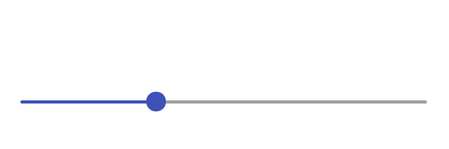
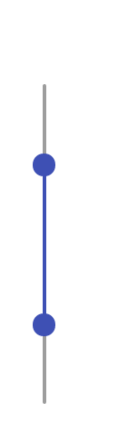

# AddSlider

> 2.1.0

```
<input data-addui='slider' />
```


## How to Use
To use this plugin create an input element, and give it a `data-addui` attribute with a value of `slider`.


## Settings
You can pass these settings into the plugin use `data-{setting_name}="{setting_value}"` or some settings are linked to specific attributes (like min, max and value).

 - **direction** = `"horizontal"`
   - Controls which directoin the slider is (horizontal or vertical)
 - **min** = `0`
   - The minimum number allowed
   - Can also be set by the `min` attribute.
 - **max** = `100`
   - The maximum number allowed
   - Can also be set by the `max` attribute.
 - **step** = `0.1`
   - The smallest incrament that the slider can be moved by.
   - Can also be set by the `step` attribute.
 - **value** = `50`
   - The inital value of the slider.
 - **fontsize** = `18`
   - Controls the size of the font in the "bubble" when sliding.
 - **formatter** = `function(num){/* Formatting Code, returns a string */}`
   - A function that is used to format the value in the bubble.
 - **timeout** = `2000`
   - The number of milliseconds that the "bubble" will appear above the slider after the handle is released.
 - **range** = `false`
   - `true` makes it a range slider.
 - **id** = `""`
   - The `id` attribute to be given to the hidden input.
   - By default this is copied from the original input (and removes the original input to avoid conflicts).
 - **class** = `""`
   - Extra classes to be given to the widget.
 - **name** = `""`
   - The `name` attribute to be given to the hidden input.
   - By default this is copied from the original input (and removes the original input to avoid conflicts).

## Custom Formats

**JavaScript**
```JavaScript
function betterParseFloat(x){
  if(isNaN(parseFloat(x)) && x.length > 0)
   return betterParseFloat(x.substr(1));
  return parseFloat(x);
}
function usd(x){
  x = betterParseFloat(x);
  if(isNaN(x))
   return "$0.00";
  var dollars = Math.floor(x);
  var cents = Math.round((x - dollars) * 100) + "";
  if(cents.length==1)cents = "0"+cents;
  return "$"+dollars+"."+cents;
}
```

**HTML**
```HTML
<input
 data-addui='slider'
 data-formatter='usd'
 data-fontsize='14'
 data-step='0.01'
 data-min='5'
 data-max='20'
 value='10'
/>
```



## Ranges

**HTML**
```HTML
<input
 data-addui='slider'
 data-min='-5'
 data-max='5'
 data-range='true'
 value='-2,2'
/>
```


## Vertical Slider

**HTML**
```HTML
<input
 data-addui='slider'
 data-direction='vertical'
/>
```


## Vertical Range

**HTML**
```HTML
<input
 data-addui='slider'
 data-direction='vertical'
 data-range='true'
 data-min='20'
 data-max='40'
 data-step='0.5'
 value='25,35'
/>
```



# License

This software is property of [**Liquir-ice**](http://github.com/Liquir-ice).

This software is distributed AS-IS with no warranties/guarantees either expressed or implied.

This software is Licensed under [CC BY-NC-SA 3.0 US](https://creativecommons.org/licenses/by-nc-sa/3.0/us/).
